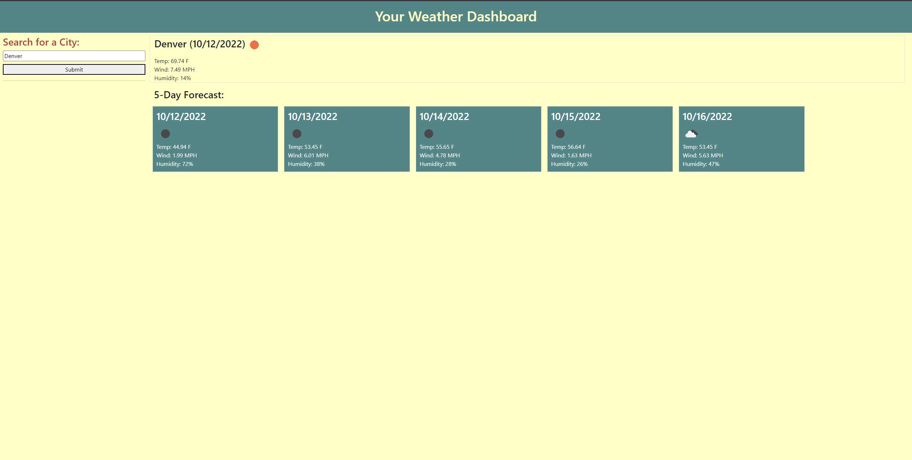

# James Porter's Weather Dashboard

## Description

Be sure you know what to expect when planning a trip or leaving the house for work with this Weather Dashboard.  

- To aid in ease of weather checking and practice Javascript skills, particularly API fetching and dynamic front end creation.  
- This project was built primarily to practice a variety of fullstack skills.   

## Usage

First, click the following link: https://jamesjporter.github.io/James-P-Weather-Dashboard/

Upon arriving at the App you will see a search bar and placeholder weather display for Los Angeles. Enter a city of your choice and hit "submit" to check the weather at any city in the world. Your search will appear just underneath the "submit" button and on the right side of the page will appear current and future weather conditions for your chosen location. 

Link to live repo: https://github.com/JamesJPorter/James-P-Weather-Dashboard

    

## Credits

Primary engineer: James Porter
With assistance from: Sofia Tejada, Sandrine Poissonnet and Erik Chan